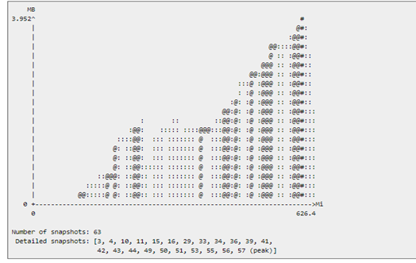
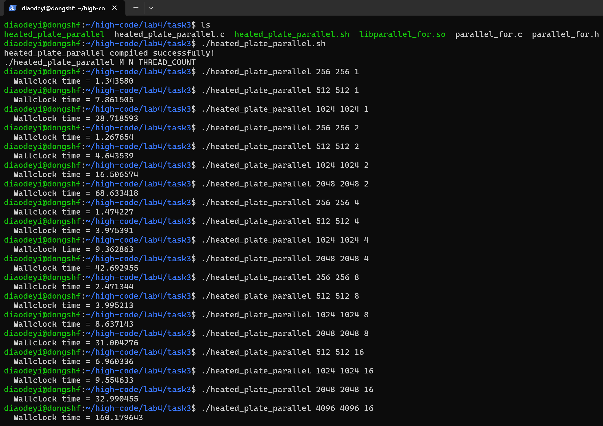
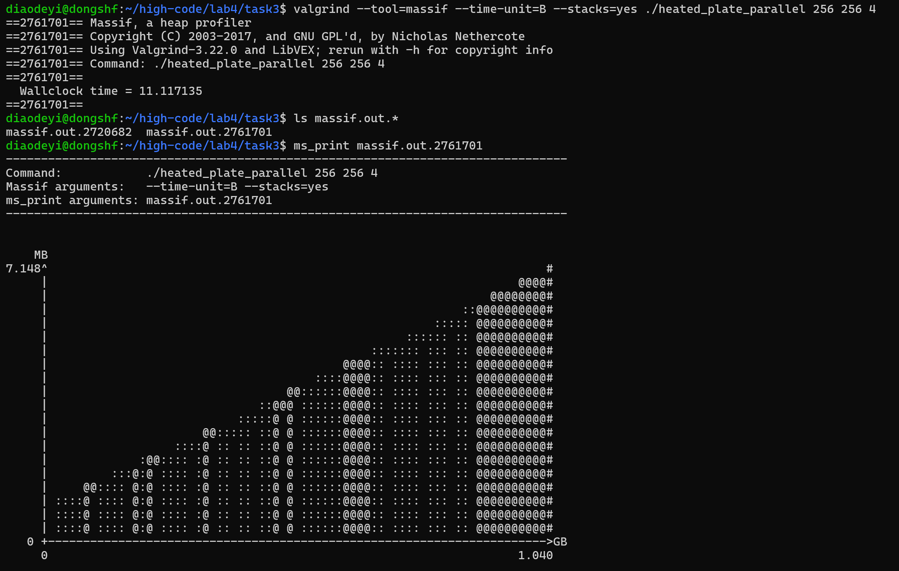
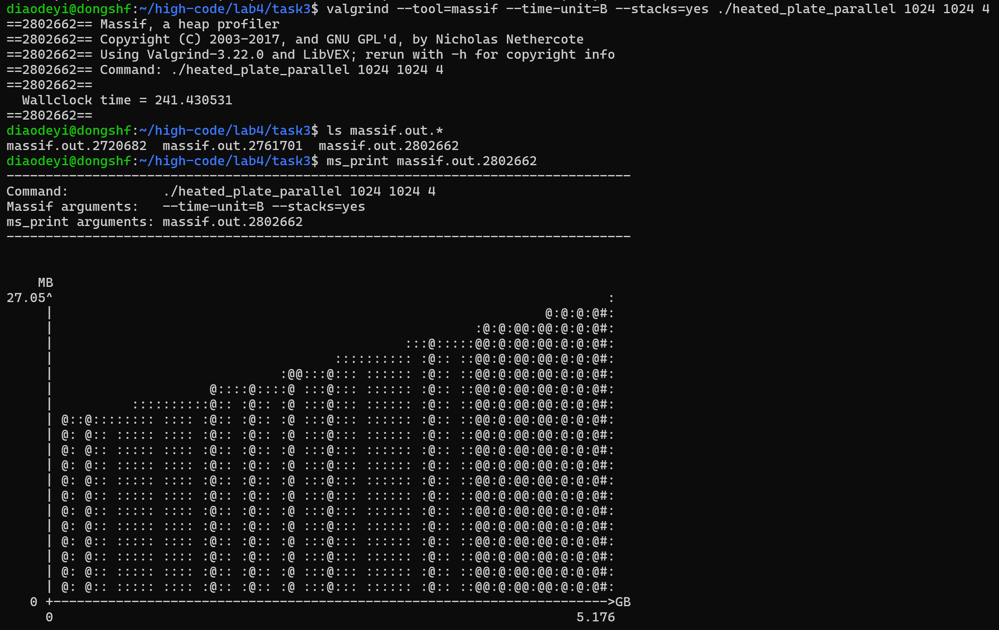
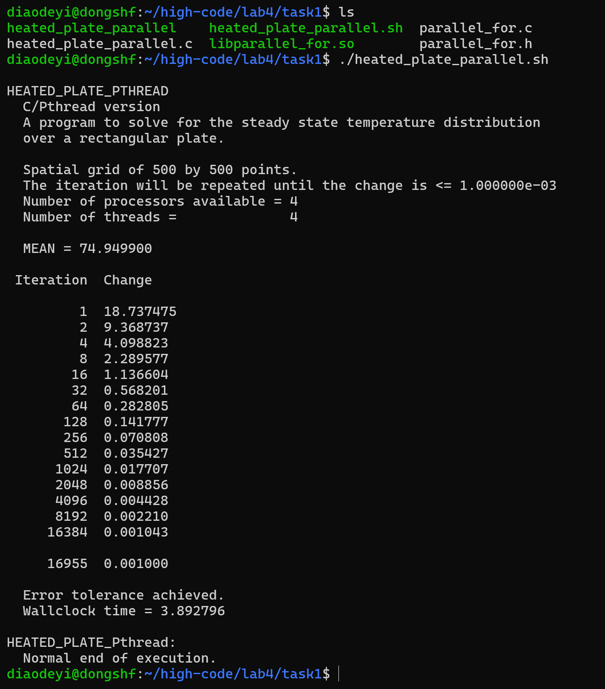
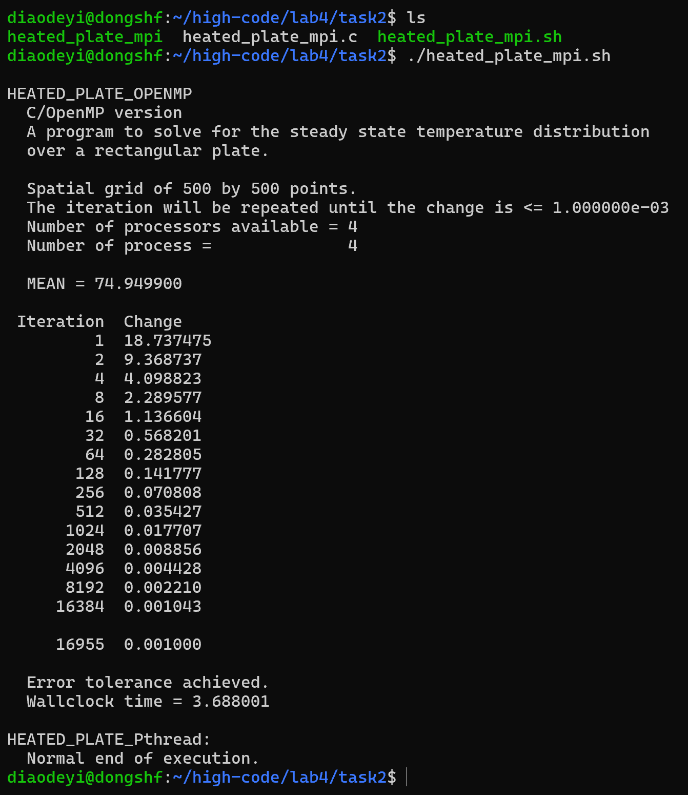

### <center>中山大学计算机院本科生实验报告
#### <center>（2024学年秋季学期）


#### 1.实验目的
将heated_plate_openmp改造成基于parallel_for的线程并行，基于OpenMPI的进程并行，并测试执行时间和内存消耗。
#### 2.实验过程和核心代码
<font color=blue>在原代码heated_plate_openmp.c中，作者使用了两个矩阵U和W，U矩阵用来保存迭代过程中上一次计算的W的值。
然而，在实验过程中，本人经过思考，认为每次迭代保存一次矩阵U的值浪费大量时间，由于矩阵U和W的对称性，完全可以在**奇数迭代**中将W视为前一个矩阵，**偶数迭代**中将U视为前一个矩阵，通过**奇偶迭代法**就避免了保存矩阵的时间。</font>

##### 任务1：
代码见task1
通过实验3构造的基于Pthreads的parallel_for函数替换heated_plate_openmp应用中的某些计算量较大的“for循环” ,实现for循环分解、分配和线程并行执行。
###### 核心代码
代码实现并不困难，将while循环迭代过程中的所有pragma omp parallel改造成lab3实现的parallel_for即可，注意定义好循环代码块update_temperature。
这里的优化是将update_temperature和calculate_diff两个函数合并，在计算迭代矩阵W的同时计算差值diff，这样可以避免两次创建线程和循环迭代。
```c
while (diff >= epsilon) {
        // 奇偶迭代
        if (iterations % 2) 
            data = (MatrixArg){w, u, 0.0};
        else 
            data = (MatrixArg){u, w, 0.0};

        // 更新温度值
        parallel_for(1, M - 1, 1, update_temperature, &data, THREAD_COUNT);
        
        diff = data.diff;

        iterations++;
        if ( iterations == iterations_print )
        {
            printf ( "  %8d  %f\n", iterations, diff );
            iterations_print = 2 * iterations_print;
            //print_matrix(w);
        }
        

    }

void* update_temperature(void *arg, int row) {
    MatrixArg *data = (MatrixArg *)arg;
    double* u = data->u, *w = data->w;
    double my_diff = 0.0;
    for (int j = 1; j < N - 1; j++) {
        w[row*N + j] = (u[(row-1)*N + j] + u[(row+1)*N + j] + u[row*N + j - 1] + u[row*N + j + 1]) / 4.0;
        my_diff = max(my_diff, fabs(w[row*N + j] - u[row*N + j]));
    }
    pthread_mutex_lock(&mutex);
    data->diff = max(data->diff, my_diff);
    pthread_mutex_unlock(&mutex);
    return NULL;
}
```

##### 任务2：
代码见task2
将heated_plate_openmp应用改造成基于MPI的进程并行应用。

实现思路与任务1大致相同，需要注意的是基于MPI的进程并行应用，不同进程之间的地址空间是独立的，因此在进程0中分配的U和W矩阵需要使用MPI的通信（全局和点对点）发送到其他进程中。

这里我选择将矩阵U和W按照行划分为不同的块local_u和local_w，由于w矩阵在迭代的过程中，需要使用上下左右四个元素的值，在边界处的更新会越过边界
<font color=blue>
为了解决这个问题，我在local_u和local_w分别多开辟两行空间（假设每个进程row行，那么开辟row+2行，下标从0到row + 1），用作通信的缓冲区，比如进程0和进程1交换信息时，进程0将第row行发送给进程1的第0行，同时从进程1中接收消息，保存在第row + 1行中。
同时为了避免死锁，点对点通信使用MPI_Sendrecv函数进行同步
具体实现如下。
</font>

###### 核心代码
```c
double update_temperature(double *u, double *w, int rows_per_proc, int rank, int size, MPI_Comm comm) {

    // 与上/下邻居交换边界行
    if (rank > 0) 
        MPI_Sendrecv(&u[N], N, MPI_DOUBLE, rank - 1, 0, &u[0], N, MPI_DOUBLE, rank - 1, 0, comm, MPI_STATUS_IGNORE);

    if (rank < size - 1) 
        MPI_Sendrecv(&u[rows_per_proc * N], N, MPI_DOUBLE, rank + 1, 0, &u[(rows_per_proc + 1) * N], N, MPI_DOUBLE, rank + 1, 0, comm, MPI_STATUS_IGNORE);
    
    double diff = 0.0;
    for (int i = 1; i < rows_per_proc + 1; i++) {
        if (i == 1 && rank == 0 || i == rows_per_proc && rank == size - 1)
            continue;
        
        for (int j = 1; j < N - 1; j++) {
            w[i * N + j] = (u[(i - 1) * N + j] + u[(i + 1) * N + j] + u[i * N + j - 1] + u[i * N + j + 1]) / 4.0;
            diff = max(diff, fabs(w[i * N + j] - u[i * N + j]));
        }
    }
    return diff;
}
```


##### 任务3：
性能分析任务：对任务1实现的并行化应用在不同规模下的性能进行分析，即分析：
1）不同规模下的并行化应用的执行时间对比；
2）不同规模下的并行化应用的内存消耗对比。
本题中，“规模”定义为“问题规模”和“并行规模”；“性能”定义为“执行时间”和“内存消耗”。
例如，问题规模N或者M，值为2，4，6，8，16，32，64，128，……， 2097152；并行规模，值为1，2，4，8进程/线程。
提示：内存消耗采用 “valgrind –tool=massif --time-unit=B ./your_exe”工具采集，注意命令valgrind命令中增加--stacks=yes 参数采集程序运行栈内内存消耗。Valgrind –tool=massif输出日志（massif.out.pid）经过ms_print打印后示例如下图，其中x轴为程序运行时间，y轴为内存消耗量：




###### 执行时间分析

单位 -- 秒
**注：有些问题规模过大，运行时间过长，不再使用个人PC进行测试**
**CPU型号 —— Intel(R) Core(TM) Ultra 9 185H**
|问题规模\并行规模|256|512|1024|2048|4096|8192|
|:---:|:---:|:---:|:---:|:---:|:---:|:---:|
|1|1.344|7.862|28.719|--|--|--|
|2|1.268|4.644|16.507|68.633|--|--|
|4|1.474|3.975|9.363|42.693|--|--|
|8|2.471|3.995|8.637|31.004|130.056|--|
|16|--|6.960|9.555|32.990|160.180|--|



###### 内存消耗分析


#### 3.实验结果
##### 任务1：
执行 task1/heated_plate_parallel.sh 


##### 任务2：
执行 task1/heated_plate_mpi.sh



#### 4.实验感想

本次实验，个人认为是对之前所有并行实验的一次综合考察。无论是对内存的精细管理还是对性能的各种优化，都对我的并行编程能力提出了更高的要求。总的来说，本次实验切实提高了我的编程能力。